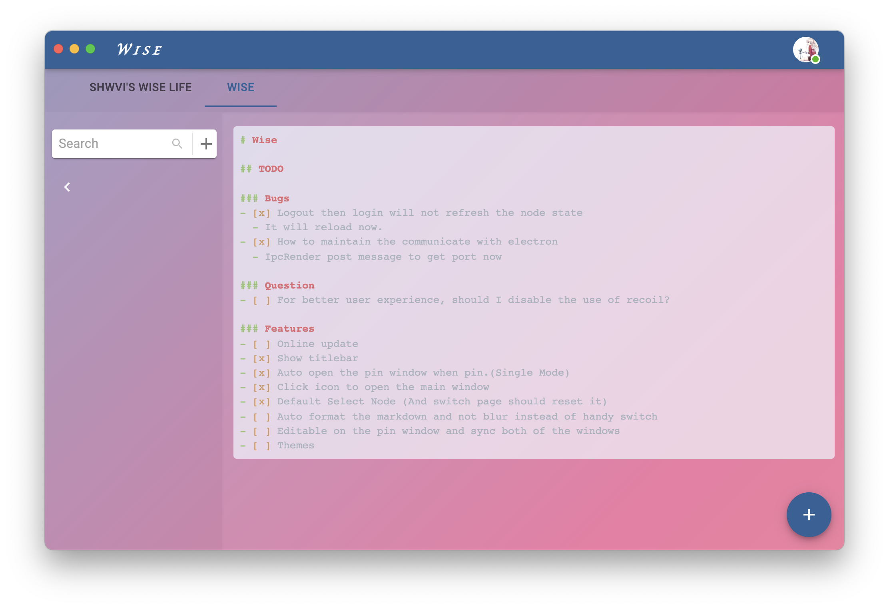

# Wise

## Description

Wise is a productive tool for manage your plans and targets.As its name saying, you are expected to manage your life and work as a wise (wo)man.



The main features of wise:

1. Tree struct data manage
2. Markdown support
3. Pin your plan on your desktop

## TODO

- [ ] Display your plans as tree
- [ ] Chinese support
- [ ] Node order changable
- [ ] React markdown plugin to enable more sytnx
- [ ] Windows and Intel MacOS support

## Develop

Install all dependencies

```bash
yarn
# generate all workspace
yarn build
```

> You are expected to install postgreSQL on your computer and a database named `shwvi`
>
> And add `secret.json` file to your wise/packages/server/src/ like follow

```json
{
  "postgre": "postgres://user:passwd@ip:port/shwvi"
}
```

Start server

```bash
# start watch changes
yarn watch
# start main win react project
yarn workspace @wise/app dev
# start pin win react project
yarn workspace @wise/pin dev
# start electron
yarn workspace @wise/electron dev
# start server
yarn workspace @wise/server dev
```

# Licensen

MIT
